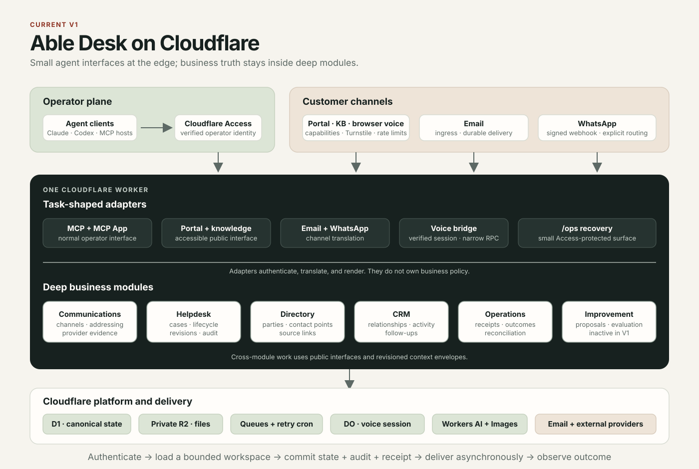

# Morrow

[](https://github.com/codeyogi911/morrow/actions/workflows/ci.yml)
[](LICENSE)

Morrow is an open-source, agent-first ERP for service businesses. It is designed as a set of deep business modules that agents can operate through small, task-shaped interfaces without collapsing the business into generic CRUD.

Morrow Desk is the first application. It combines a support desk, customer directory, CRM, communications inbox, durable operations, and controlled improvement records on Cloudflare Workers. MCP is the normal operator interface; customers use an accessible support portal and approved channels; `/ops` is a small Cloudflare Access-protected recovery surface.

> **Project status:** early V1. The architecture and core Desk flows are implemented and tested, but Morrow does not yet claim production readiness. A deployed Worker is not, by itself, an operational support desk.

[Project site](https://codeyogi911.github.io/morrow-site/) · [V1 contract](docs/product-v1.md) · [Roadmap](docs/roadmap.md) · [Architecture overview](docs/architecture-overview.md) · [Architecture reference](docs/architecture.md)



## Why agent-first

The normal Desk loop is intentionally small:

1. `morrow_case_next` returns a complete decision workspace.
2. `morrow_case_reply` commits a reply against its exact opaque revision.

The module—not the agent or transport adapter—owns lifecycle policy, authorization, audit evidence, idempotency, delivery intent, and concurrency checks. MCP, the portal, email, WhatsApp, and `/ops` authenticate, translate, and render.

## What Desk V1 includes

- Case queues, search, assignment, priority, lifecycle, public replies, and private notes
- Public knowledge, request intake, private case links, attachments, and bounded attachment evidence
- Browser text help, optional voice input, and optional read-only Shopify order lookup
- Channel-neutral conversations with explicit routing to support, sales, both, or no work
- Signed WhatsApp text ingress and conversation-owned replies
- Canonical parties, CRM relationships, sourced activities, and scheduled follow-ups
- Durable operations, immutable receipts, outcome observations, and inactive evaluation-gated improvements
- Cloudflare Access identity for MCP and `/ops`, plus a public portal protected by capabilities and Turnstile
- D1, private R2 objects, Workers AI, Cloudflare Email Service, and a durable outbox

The exact scope and exclusions are binding in [docs/product-v1.md](docs/product-v1.md).

## Repository structure

```text
morrow/
├── apps/
│   └── desk/          # Buildable Desk Worker, migrations, tests, assets, and configs
├── packages/          # Future reusable modules, extracted only behind proven interfaces
├── docs/              # Product contract, architecture visuals, ADRs, deployment, and roadmap
├── scripts/           # Repository-wide publication and history gates
└── .github/           # CI, security scanning, and contributor templates
```

Desk remains one honest buildable workspace for the first public release. Modules will move to `packages/` only when each has an independent interface and test boundary; see [packages/README.md](packages/README.md).

## Develop

Requirements: Node.js 22 or 24+, npm, and a Cloudflare account for remote deployment.

```sh
npm install
npm run db:migrate:local
npm run dev
```

Copy `apps/desk/.dev.vars.example` to `apps/desk/.dev.vars` for local-only values. Never commit the resulting file.

Run the complete local gate before opening a pull request:

```sh
npm run check
```

Changes to voice prompts or tool descriptions also require:

```sh
npm run eval:voice
```

## Upstream and proving deployments

This repository is the canonical development source. Hosted proving grounds deploy exact commits through protected environments; they are not private product forks. Tenant secrets, resource coordinates, content, customer data, and operational runbooks remain outside source control. A lesson found in a proving deployment becomes a generic issue, neutral test, and upstream change here.

See [docs/development.md](docs/development.md) for the full workflow and [docs/deployment.md](docs/deployment.md) for the deployment boundary.

## Community

Questions belong in [Discussions](https://github.com/codeyogi911/morrow/discussions); bugs and proposals belong in [issues](https://github.com/codeyogi911/morrow/issues/new/choose). See [CONTRIBUTING.md](CONTRIBUTING.md), [GOVERNANCE.md](GOVERNANCE.md), [SECURITY.md](SECURITY.md), and [CODE_OF_CONDUCT.md](CODE_OF_CONDUCT.md).

Morrow is licensed under [Apache-2.0](LICENSE).
