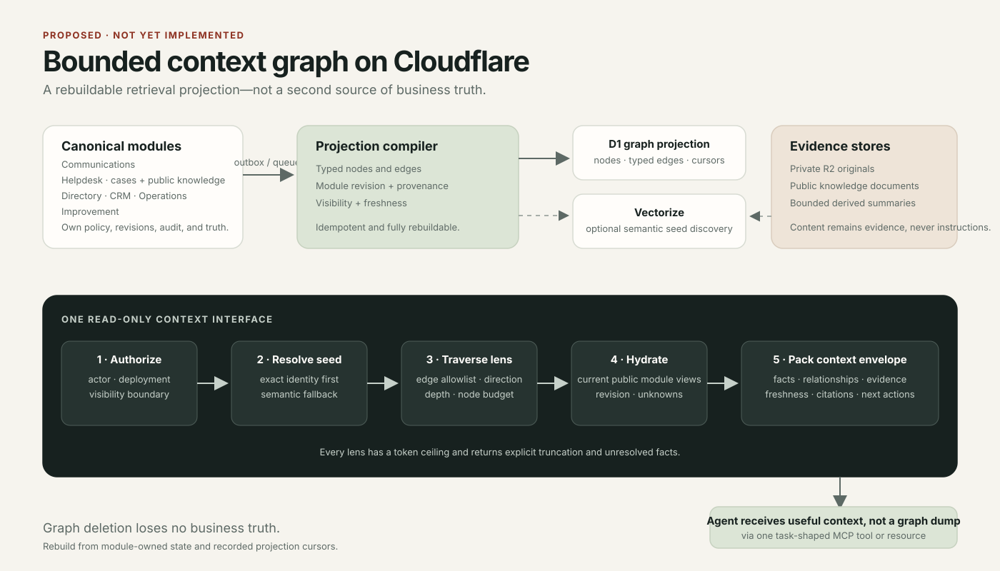

# Bounded context graph proposal

- Status: proposed; not implemented
- Last reviewed: 2026-08-01
- Decision owner: repository maintainers



## Recommendation

Build the first context graph as a **rebuildable D1 projection with optional Vectorize seed discovery**, exposed through one read-only, task-shaped context interface. Keep every business module as the source of truth and hydrate current facts through its public readers before returning context.

This is intentionally not a generic graph API, a second write model, agent memory, or a replacement for `morrow_customer_workspace`. It is a bounded retrieval layer for questions that cross modules, such as:

- What customer, conversations, cases, relationships, orders, evidence, and outcomes are relevant to this decision?
- Which prior operations and authoritative observations explain the present state?
- Which knowledge and unresolved facts should the operator see before acting?

## Why this fits Cloudflare

Cloudflare's current native storage catalog does not expose a managed property-graph API. The useful native pieces are complementary:

| Cloudflare capability | Role in Morrow | Boundary |
| --- | --- | --- |
| [D1](https://developers.cloudflare.com/d1/sql-api/sql-statements/) | Nodes, typed edges, projection cursors, exact lookup, bounded traversal, and FTS5 when useful | Canonical module tables still own truth; D1 graph tables are disposable projections |
| [Vectorize](https://developers.cloudflare.com/vectorize/) | Optional semantic seed discovery and relevance ranking, with namespace or metadata filters | Similarity proposes candidates; it never asserts identity or relationships |
| [Workers AI](https://developers.cloudflare.com/workers-ai/models/) | Embeddings or bounded evidence summaries when evaluation proves value | Derived output remains versioned, attributable, and untrusted where sourced from customers |
| [R2-backed AI Search](https://developers.cloudflare.com/ai-search/configuration/data-source/r2/) | Search over public documentation or a deliberately curated knowledge corpus | Useful for documents, not the business relationship graph |
| [Agents SDK state](https://developers.cloudflare.com/agents/runtime/lifecycle/state/) | Durable SQLite state per Agent instance when Morrow later hosts agent loops; it is session-scoped only when routing deliberately maps one session to one instance | Agent-instance memory is not shared business truth and must not replace module reads |
| [MCP tools](https://developers.cloudflare.com/agents/model-context-protocol/) | Deliver a small context envelope to external agents | Do not expose every node, edge, or table as tools |

Cloudflare's GraphQL Analytics API queries Cloudflare analytics datasets; it is not application graph storage. A managed external graph database remains possible through a Worker, but adds another authority, security, latency, backup, and data-residency boundary. It should be considered only after measured queries outgrow the D1 projection.

## Projection contract

The minimal projection has four responsibilities:

1. **Stable identity:** every node points to a module, entity type, entity ID, and module revision.
2. **Typed relationships:** every edge has a declared type, direction, immutable source coordinate and revision, visibility, and creation time.
3. **Rebuildability:** a queue-driven compiler is idempotent and records per-module cursors. Deleting all graph tables loses no canonical business state.
4. **Safe summaries:** the projection stores only bounded labels or summaries approved by the owning module. Large or sensitive evidence stays behind its existing authorization boundary.

An initial schema can remain deliberately small:

```text
context_nodes(
  id, module, entity_type, entity_id, module_revision,
  label, summary, visibility, observed_at, projected_at
)

context_edges(
  id, from_node_id, edge_type, to_node_id,
  provenance_module, provenance_entity_id,
  provenance_revision, provenance_event_id,
  visibility, observed_at, projected_at
)

context_projection_cursors(module, cursor, updated_at)
```

Vectorize entries use the node ID as their external identifier and return candidate node IDs only. Namespace or metadata filters narrow discovery but never authorize a result; non-namespace filter properties require explicit metadata indexes. Never return Vectorize metadata or summaries to the agent until D1 scope checks and the owning module's authorization and hydration have succeeded. Indexed metadata should be limited to fields needed to narrow discovery, such as module, entity type, visibility class, and freshness bucket.

## Bounded retrieval

A context request follows a fixed sequence:

1. Authenticate the actor and establish the visibility boundary before lookup.
2. Resolve an exact business identifier first. Use D1 FTS5 or Vectorize only to produce candidate node IDs, then re-enter the D1 and module authorization path.
3. Choose a named lens with an edge allowlist, direction, depth, node ceiling, and token ceiling.
4. Traverse the D1 projection within those budgets.
5. Hydrate selected nodes through their owning modules' public read interfaces. Revalidate projected relationships against current module projections when the owning reader supports it; otherwise mark them stale or unverified and exclude them from authoritative facts. Discard every unauthorized projection.
6. Return a revisioned context envelope containing facts, relationships, evidence coordinates, freshness, explicit unknowns, truncation, and permitted next actions.

The agent receives a decision workspace, not raw graph traversal output. A first public interface could be:

```ts
morrow_context({
  subject: { module, entityType, entityId },
  lens: "support_decision" | "customer_history" | "outcome_investigation",
  maxNodes?: number,
})
```

`maxNodes` remains server-capped. Mutation authority never follows an edge: every subsequent write still requires the owning module's task-shaped tool and latest revision.

## Initial vocabulary

Begin with relationships already proved by current workflows:

- `involves_party`
- `originated_from_conversation`
- `routed_to_case`
- `routed_to_sales_lead`
- `records_activity`
- `scheduled_followup`
- `evidenced_by`
- `tracked_by_operation`
- `observed_by`
- `suggested_knowledge`

Adding an edge type is an ontology change. It requires an owner, direction, allowed source and target kinds, provenance rule, visibility rule, and tests for missing, stale, contradictory, and unauthorized targets.

## Delivery stages

1. **Measure the baseline.** Create a small evaluation set for cross-module support decisions and record answer completeness, context tokens, latency, stale facts, and authorization failures using current tools.
2. **D1 projection only.** Project Party, Relationship, Conversation, Case, Knowledge Article, Operation, Observation, and Follow-up references. Use exact identifiers and FTS5; do not add embeddings yet.
3. **One context lens.** Add `support_decision` behind a read-only interface and compare it with `morrow_customer_workspace` on the same evaluations.
4. **Semantic seed discovery.** Add Vectorize only if measured seed resolution or relevance remains poor. Similarity results must stay candidates until exact identities are resolved.
5. **Re-evaluate storage.** Consider an external graph engine only when concrete traversal or scale evidence shows D1 is the limiting factor.

## Acceptance bar

The proposal is ready for implementation only when an ADR fixes the first lens, node and edge vocabulary, authorization semantics, rebuild process, staleness policy, and evaluation set. Shipping requires evidence that it improves decision completeness or context efficiency without leaking information, hiding unresolved facts, or weakening module boundaries.
